# Лабораторная работа №1

## Задание 1
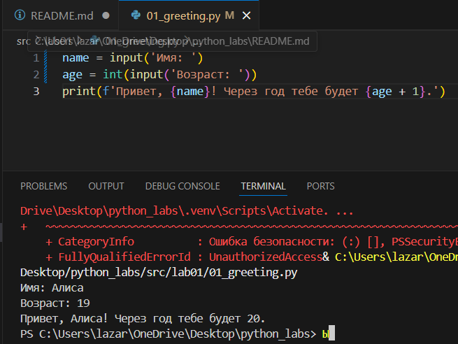

## Задание 2
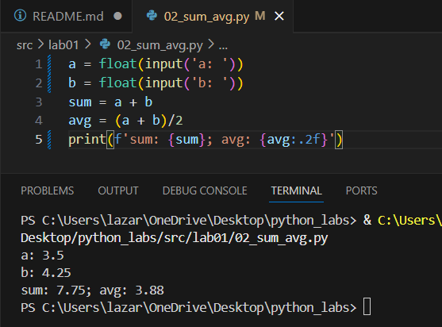

## Задание 3
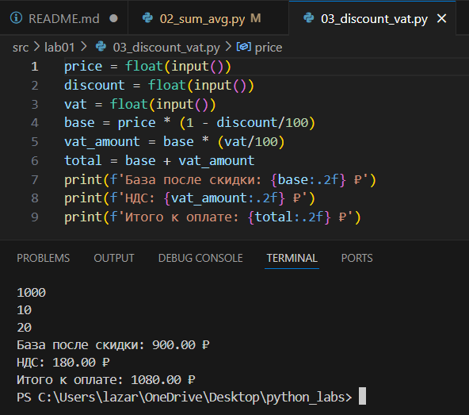

## Задание 4
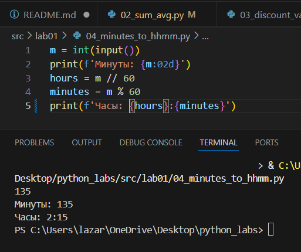

## Задание 5
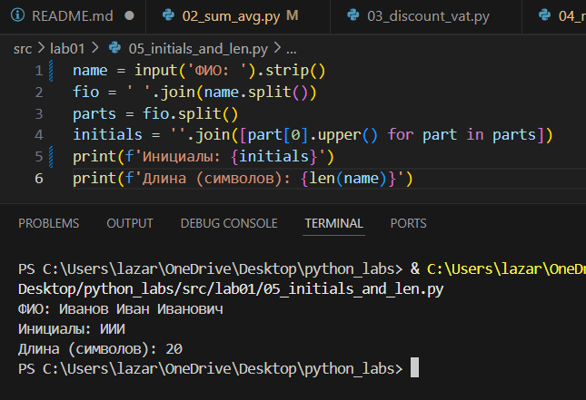


# Лабораторная работа №2
## Задание A

```python
def min_max(nums: list[float | int]) -> tuple[float | int, float | int]:
    if not nums:
        return ValueError
    return(min(nums), max(nums))
print(min_max([3, -1, 5, 5, 0]))
print(min_max([42]))
print(min_max([-5, -2, -9]))
print(min_max([]))
print(min_max([1.5, 2, 2.0, -3.1]))
```
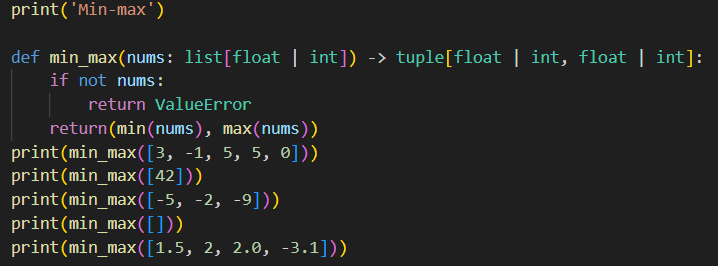
```python
def unique_sorted(nums: list[float | int]) -> list[float | int]:
    return sorted(set(nums))
print(unique_sorted([3, 1, 2, 1, 3]))
print(unique_sorted([]))
print(unique_sorted([-1, -1, 0, 2, 2]))
print(unique_sorted([1.0, 1, 2.5, 2.5, 0]))
```
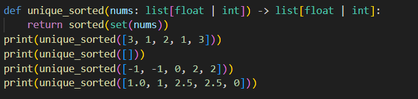
```python
def flatten(mat: list[list | tuple]) -> list:
    result = []
    for r in mat:
        if not isinstance(r, (list, tuple)):
            return TypeError
        result.extend(r)
    return result
print(flatten([[1,2], [3,4]]))
print(flatten([[1,2], (3, 4, 5)]))
print(flatten([[1], [], [2, 3]]))
print(flatten([[1, 2], "ab"]))
```
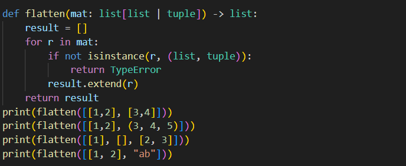
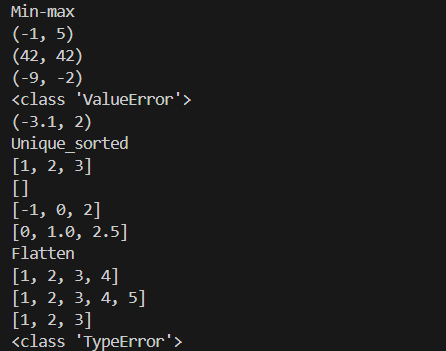

## Задание B

```python
def transpose(mat: list[list[float | int]]) -> list[list]:
    if not mat:
        return []
    row_length = len(mat[0])
    for i, row in enumerate(mat):
        if len(row) != row_length:
            return ValueError
    result = []
    for cl in range(len(mat[0])):
        new_row = []
        for row in range(len(mat)):
            new_row.append(mat[row][cl])
        result.append(new_row)
    return result
print(transpose([[1, 2, 3]]))
print(transpose([[1], [2], [3]]))
print(transpose([[1, 2], [3, 4]]))
print(transpose([]))
print(transpose([[1, 2], [3]]))
```
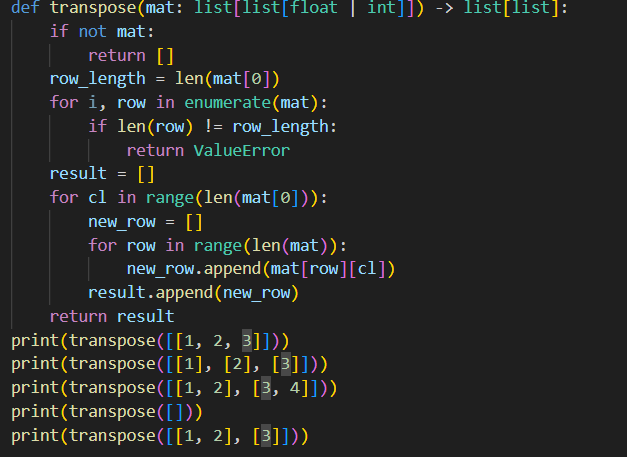
```python
def row_sums(mat: list[list[float | int]]) -> list[float]:
    if not mat:
        return []
    row_length = len(mat[0])
    for i, row in enumerate(mat):
        if len(row) != row_length:
            return ValueError
    result = []
    for row in mat:
        result.append(sum(row))
    return result
print(row_sums([[1, 2, 3], [4, 5, 6]]))
print(row_sums([[-1, 1], [10, -10]]))
print(row_sums([[0, 0], [0, 0]]))
print(row_sums([[1, 2], [3]]))
```
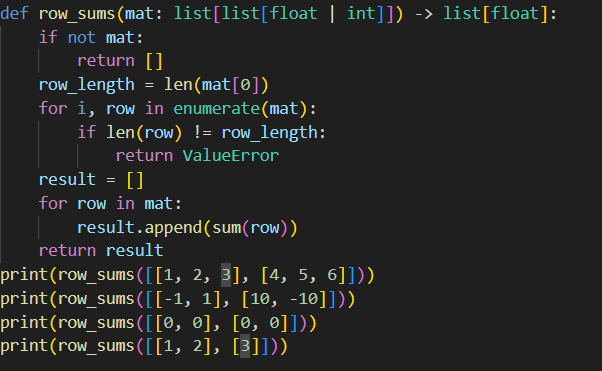
```python
def col_sums(mat: list[list[float | int]]) -> list[float]:
    if not mat:
        return []
    row_length = len(mat[0])
    for i, row in enumerate(mat):
        if len(row) != row_length:
            return ValueError
    result = []
    for col in range(len(mat[0])):
        col_sum = 0
        for row in range(len(mat)):
            col_sum += mat[row][col]
        result.append(col_sum)
    return result
print(col_sums([[1, 2, 3], [4, 5, 6]]))
print(col_sums([[-1, 1], [10, -10]]))
print(col_sums([[0, 0], [0, 0]]))
print(col_sums([[1, 2], [3]]))
```
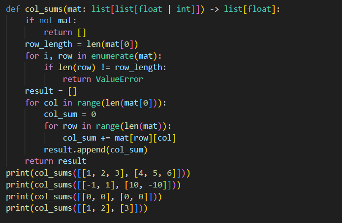
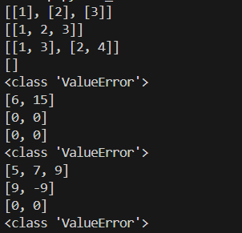

## Задание C
```python
def format_record(rec: tuple[str, str, float]) -> str:
    fio, gr, gpa = rec
    fio2 = ' '.join(fio.split()).split()
    fam = fio2[0]

    ini = []
    for i in range(1, len(fio2)):
        if i <= 2:
            ini.append(f'{fio2[i][0]}.')
    res = f'{fam} {' '.join(ini)}, гр. {gr}, GPA {gpa:.2f}'
    return res
t = ("Иванов Иван Иванович", "BIVT-25", 4.6)
print(format_record(t))
```
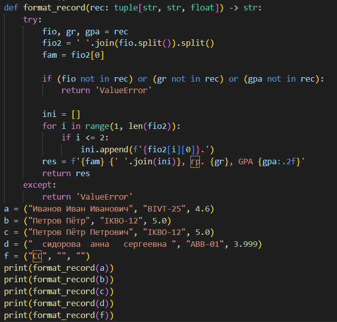
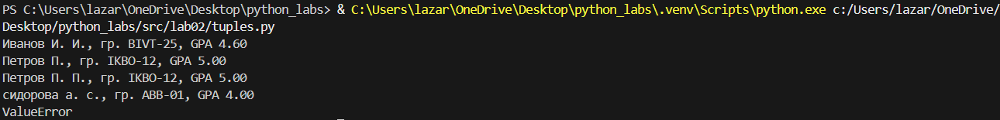

# Лабораторная работа №3
## Задание A
``` python
def normalize(text: str, *, casefold: bool = True, yo2e: bool = True) -> str:
    if casefold == True:
        text = text.casefold()
    if yo2e:
        text = text.replace('ё', 'е').replace('Ё', 'Е')
    text = ' '.join(text.split())
    text = text.strip()
    return text
print(normalize("ПрИвЕт\nМИр\t"))
print(normalize("ёжик, Ёлка"))
print(normalize("Hello\r\nWorld"))
print(normalize("  двойные   пробелы  "))
```
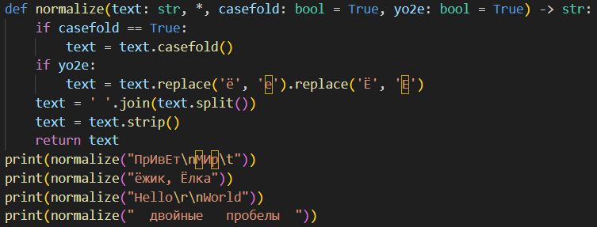

``` python
import re

def tokenize(text: str) -> list[str]:
    t = r'[\w]+(?:-[\w]+)*'
    l = re.findall(t, text, re.UNICODE)
    return l
print(tokenize("привет мир"))
print(tokenize("hello,world!!!"))
print(tokenize("по-настоящему круто"))
print(tokenize("2025 год"))
print(tokenize("emoji 😀 не слово"))
```
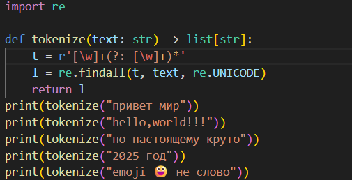

``` python
def count_freq(tokens: list[str]) -> dict[str, int]:
    freq = {}
    for i in tokens:
        if i in freq:
            freq[i] += 1
        else:
            freq[i] = 1
    return freq

def top_n(freq: dict[str, int], n: int = 5) -> list[tuple[str, int]]:
    items = []
    for word in freq:
        count = freq[word]
        items.append((word, count))
    items.sort(key=lambda i: (-i[1], i[0]))
    return items[:n]

print(count_freq(["a","b","a","c","b","a"]))
print(count_freq(["bb","aa","bb","aa","cc"]))
print(top_n(count_freq(["a","b","a","c","b","a"])))
print(top_n(count_freq(["bb","aa","bb","aa","cc"])))
```
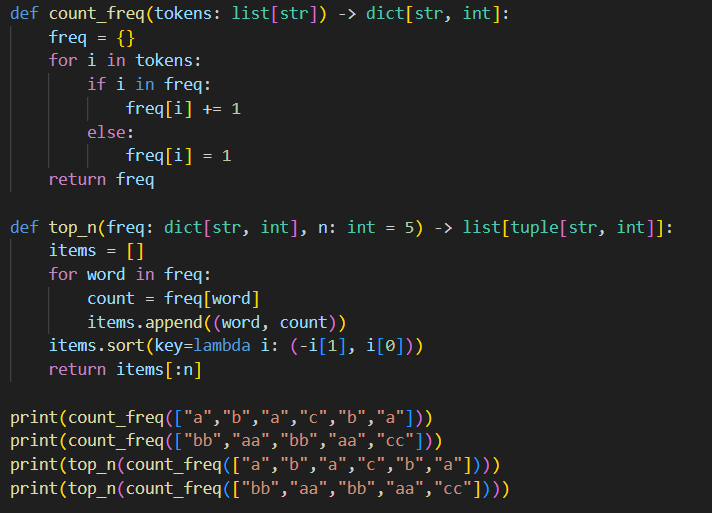
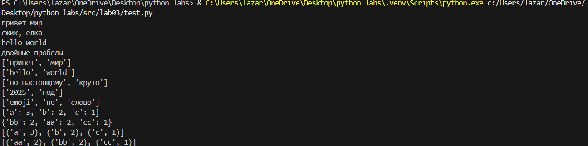

## Задание B
``` python
import sys
import re

def normalize(text: str, *, casefold: bool = True, yo2e: bool = True) -> str:
    if yo2e:
        text = text.replace('ё', 'е').replace('Ё', 'Е')
    if casefold:
        text = text.casefold()
    text = ' '.join(text.split())
    text = text.strip()
    return text

def tokenize(text: str) -> list[str]:
    t = r'[\w]+(?:-[\w]+)*'
    l = re.findall(t, text, re.UNICODE)
    return l

def count_freq(tokens: list[str]) -> dict[str, int]:
    freq = {}
    for i in tokens:
        if i in freq:
            freq[i] += 1
        else:
            freq[i] = 1
    return freq

def top_n(freq: dict[str, int], n: int = 5) -> list[tuple[str, int]]:
    items = []
    for word in freq:
        count = freq[word]
        items.append((word, count))
    items.sort(key=lambda i: (-i[1], i[0]))
    return items[:n]

a =  "Привет, мир! Привет!!!"

nt = normalize(a)
allwords = tokenize(nt)
uw = count_freq(allwords)
top = top_n(uw, 5)

print(f'Всего слов: {len(allwords)}')
print(f"Уникальных слов: {len(uw)}")
print("Топ-5:")
for y in top:
    print(y[0] + ': ' + str(y[1]))
```
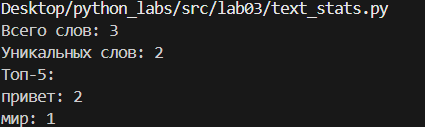